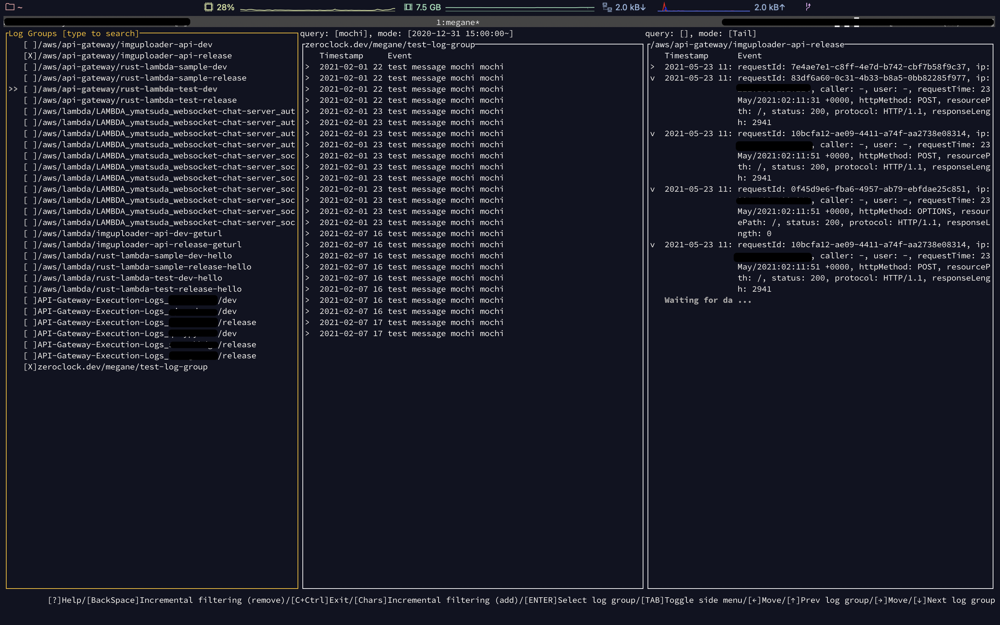

# megane

[](https://codecov.io/gh/zeroclock/megane) [](https://travis-ci.com/zeroclock/megane)

A simple AWS Cloudwatch Logs CLI viewer.



## Getting Started
### Prerequisites

- AWS Credentials (https://docs.aws.amazon.com/cli/latest/userguide/cli-configure-files.html)

This tool refer to your AWS CLI credentials configuration file (`~/.aws/credentials`) implicitly.

### Installation

1. Download the binary from [Release page](https://github.com/zeroclock/megane/releases/latest).
2. Extract it into the directory in the path.

## Usage

```
AWS Cloudwatch cli viewer

USAGE:
    megane [FLAGS] [OPTIONS]

FLAGS:
    -d, --debug      Debug mode. Events will be written to ./log/output.log .
    -h, --help       Prints help information
    -V, --version    Prints version information

OPTIONS:
    -p, --profile <profile>        Specific AWS profile. If not provided, default profile will be used.
    -r, --region <region>          Specific AWS region. If not provided, default region will be used.
    -a, --role_arn <role_arn>      The role arn you want to assume.
    -n, --role_name <role_name>    The role name you want to assume. Ensure that your current credential is allowed to
                                   action 'iam:GetRole'
```

### Using default profile (`default`) and region (`us-east-1`)

```
megane
```

### Using specific profile and region

```
megane -p your-profile -r ap-northeast-1
```

### Using a assumed role (specified with the role's ARN)

```
megane -a arn:aws:iam::account:role/role-name-with-path
```

### Using a assumed role (specified with the role's name)

To use this option, your current credential must be allowed to the action `iam:GetRole`.

```
megane -n your-role-name
```

## Contributing

Any contributions you make are greatly appreciated.

## License

Distributed under the MIT License. See `LICENSE` for more information.
